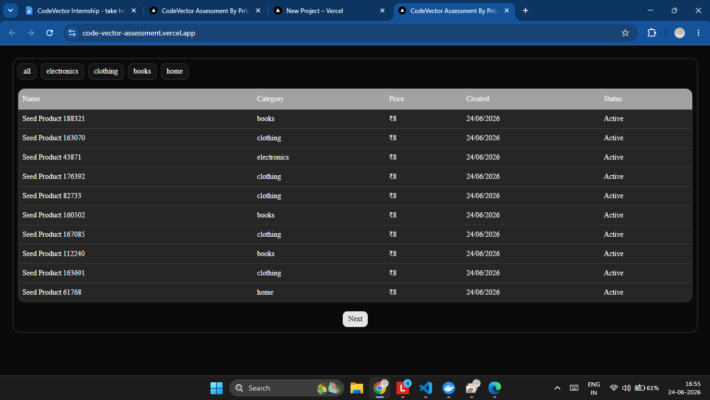

# Short note

## For frontend
- Used `nextjs` framework to quikly complete the task.
- Used `shadcn ui` and `tailwind` to quickly make ui with ai.
- Used `PostgreSQL` because it is more reliable (supabase)

## For backend
- Used cursor-based pagination with `created_at, id` ordered by newest first. 
- Chose this to ensure stable pagination without duplicates or missing items when add new stuff

## AI usage
- Used Ai to quickly generate ui.
- Used Ai to avoid writing loop to seed data.

### chats with Ai
https://chatgpt.com/share/6a3bc67b-d094-83ee-9f3c-116bd83075e2

https://chatgpt.com/share/6a3bc972-4e98-83ee-a6c0-140bfad58c5a

---
## Task requirements
https://docs.google.com/document/u/0/d/15qjI-o303wCZSkEVwsoUn-vKWM5nC2Xaz45XR0v6xAY/mobilebasic
---

## 🔴 Demo

### 🔴 🖼️ Screenshot

### 🔴 🖼️ Live
https://code-vector-assessment.vercel.app/

---

# Seed result
`Inserted 200000 items in: 2.094s`

